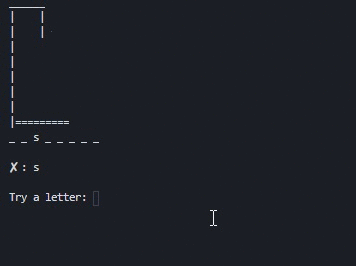

# Hangman CLI

 

Hangman is a popular word game,and using python I created a CLI version of it, 

### Preview :computer:

### Setup :wrench:

- Clone this repo to your local machine using 
`git clone https://github.com/dev-pos/hangman-cli.git`

- Then simply run the script using 
`python hangman.py`

### TODO :clipboard: 
- [ ] Create a Game Menu 
- [ ] Dificulty Levels, Hints, Scoreboard etc...
- [ ] Maybe sounds? :wink:

---

### License :scroll:

- **[MIT license](http://opensource.org/licenses/mit-license.php)**